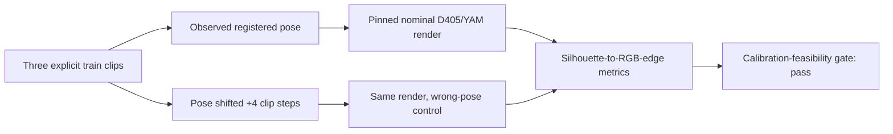

# ABC D405 nominal geometry probe

## Question

Can the official YAM MuJoCo model provide an inference-valid, action-derived
robot-motion scaffold for ABC video generation, without using clean future
video features?

This first probe tests only the prerequisite: whether a nominal robot render is
better aligned with observed train RGB when driven by the matching observed
pose than when driven by a time-shifted pose. It is not a generator-quality
experiment.

## Leakage contract

- Input rows must carry `split=train`; validation and test rows are rejected.
- Every bundle records `protected_test_accessed=false` and is hash checked.
- No future-video feature is supplied to a generator.
- Observed states are used only for this geometry/calibration diagnostic. A
  deployable scaffold must replay the action trajectory available before RGB
  denoising.

## Pinned geometry and mapping

- Official source: `amazon-far/abc` commit
  `6bc6586721cf0c409ccee80f675a28de9b9b2f5e`.
- Official scene: `assets/put_bottles/put_bottle.xml`.
- Only the visual YAM meshes, two arms, and nominal D405 cameras are retained;
  task objects and collision geometry are excluded from rendering.
- LACWM ABC order is `[left arm 6, right arm 6, left grip, right grip]`.
- Official ABC sim order is `[left arm 6, left grip, right arm 6, right grip]`.
  The exact cache permutation is `[0,1,2,3,4,5,12,6,7,8,9,10,11,13]`.
- Gripper aperture is mapped from `[0,1]` to paired finger qpos
  `+/- aperture * 0.0475`.

## Probe

For each selected D405 train clip:

1. extract the registered 13 top-camera frames, matching observed joint and
   gripper states, and raw MCAP intrinsics;
2. derive MuJoCo vertical FOV from the episode's `fy` while retaining the
   official nominal camera extrinsic;
3. render a robot-only segmentation mask for the aligned pose;
4. render a cyclic four-frame time-shifted pose as the negative control;
5. compare each rendered silhouette boundary with Canny edges in observed RGB
   using mean edge distance and support within three pixels;
6. bootstrap the paired shifted-minus-aligned distance across frames;
7. save aligned/control overlays and render latency.

The exploratory diagnostic gate requires a positive 95% bootstrap lower bound
for shifted-minus-aligned edge distance and higher aligned three-pixel support.
Even a pass establishes only nominal geometric signal; it does not establish
video-generation benefit.

## Usage

```bash
python tools/abc_d405_nominal_geometry_probe.py extract \
  --clip-manifest /path/to/train.jsonl \
  --preprocessed-root /path/to/abc_pp \
  --raw-root /path/to/abc_raw/data/train \
  --clip-id CLIP_ID --max-clips 3 \
  --output-dir /path/to/bundles

MUJOCO_GL=egl python tools/abc_d405_nominal_geometry_probe.py evaluate \
  --bundle-dir /path/to/bundles \
  --official-abc-root /path/to/amazon-far-abc \
  --output-dir /path/to/results
```

Results and interpretation are appended only after the train-only run is
complete.

## Completed train-only result

### Decision

**The calibration-feasibility gate passed.** On three deliberately selected
high-motion D405 training clips, the official nominal robot silhouette driven
by the registered pose was consistently closer to observed RGB edges than the
same silhouette driven by a four-clip-step wrong pose. This is evidence that a
cheap, action-derived robot geometry scaffold is worth testing. It is **not**
video-quality evidence, does not validate a dual-diffusion model, and does not
establish episode-specific calibration.

No generator was launched. No validation or protected-test example was used.
The probe used observed states only to test geometry feasibility; an inference
experiment must replace them with an action/controller rollout.



### Exact source and mapping

- Probe evaluation code: commit
  `f917ac21813bf6b5648c4c72595fe8697a57a2f6`; tool SHA-256
  `cf69cc806260e3c14cfe5826d0a29f8250d12acdba102452ef09400fc55022ac`.
- Bundle extraction code: commit
  `b5207208b7a53438f1c68d0b2d497c79136605b1`; extraction identity
  `f146ac94ddd2f28e08b3b0e81b2cf14b1a9b29614cf10cd1dcf23475cba1f4e1`.
- Official ABC: commit
  `6bc6586721cf0c409ccee80f675a28de9b9b2f5e`; source XML SHA-256
  `ceb8195e652b8ed49f7faf9be6dfc5a6600028f04ae8f83365501c7e1c74f41c`.
- Official camera chain is in `assets/put_bottles/put_bottle.xml:195-204`:
  gate `z=0.75`, top bar `z=0.915`, D405 body
  `pos=[0.08600512,-0.009,0.03932053]`,
  `quat=[0.183012,0.683013,0.683013,0.183012]`, frame offset
  `[0.009,0,0]`, and camera `quat=[0,1,0,0], fovy=58`.
- Compiled nominal camera world position is
  `[0.08600512,0,1.70432053]`; camera-to-world rotation is

  ```text
  [[ 0,  0.86602647, -0.49999815],
   [-1,  0,           0          ],
   [ 0,  0.49999815,  0.86602647]]
  ```

- Cache-to-official 14-D permutation is exactly
  `[0,1,2,3,4,5,12,6,7,8,9,10,11,13]`. Direct pose rendering maps
  `joint_states=[left6,right6]` and normalized grippers to paired finger qpos
  `+/- gripper*0.0475`.

Recorded `fy` was applied as per-episode vertical FOV. The probe deliberately
did not claim full calibration: MuJoCo retained a centered principal point and
did not apply recorded D405 distortion. Recorded intrinsics were:

| Clip prefix | `fx` | `fy` | `cx` | `cy` | Render FOV-y |
|---|---:|---:|---:|---:|---:|
| `2d2d0418ab00` | 432.267 | 431.826 | 425.580 | 240.519 | 58.129° |
| `74181145da4e` | 436.264 | 435.131 | 310.100 | 241.934 | 57.759° |
| `79b721951261` | 436.264 | 435.131 | 310.100 | 241.934 | 57.759° |

The unusual `cx=425.58` in the first episode is retained as an audit warning,
not silently corrected.

### Exact train clips and artifact identities

| Clip ID | Task/episode | Bundle identity |
|---|---|---|
| `2d2d0418ab005fd12b90d7a8fc16a6ee6d0bf122e33574c248c4cec94c2b70b7` | `erase_the_whiteboard/episode_9382ca17-b040-4a07-86fa-d879219f3678` | `01f63242d008c9a9cb24529e2cb80de73b91a74d4b1b9cca6a46ff8a3575af7b` |
| `74181145da4eaf61fb489166735fbd07af53dadf15736acebd0ca85d55aaa34e` | `fold_and_stack_the_skirts/episode_445b90e6-1c09-45cb-af4d-387d3dd671f5` | `c488599f36b23a05f9a062ed780985ac6ec56c18f3de63808556c7b3ce681f9b` |
| `79b721951261213371bbd2fb7f1a39a936b721b13d8e4d2f54e424ab584a6adf` | `fold_and_stack_the_skirts/episode_ffa2cfb9-b68a-4a0f-aa14-6af22991e463` | `02810cf30d3d97620386233be106a480ff8ca6ce418ac2975e20f12adb655f0a` |

The 39-frame analysis identity is
`7d290d9b74d07d1dc3f8e1c52aa8d02c016273fc4874eb2476c7a63e7e8d49f9`.
The serialized `analysis.json` SHA-256 is
`4eec59e53fb157401813ecba62c4fd45f6ac3fcb6452e5287a8643c0d530d31e`;
the row-level artifact SHA-256 is
`e1773d7929aa21b2c8ce9164ff18df68a19acf7ca884893460a01eff248251fe`.

Artifacts live outside Git under:

```text
/mnt/data1/ldu/research/Dual Video Diffusion/artifacts/abc_d405_nominal_probe/
  abc-d405-train3-b520720/bundles/
  abc-d405-train3-b520720/results_shift4_f917ac2/
```

The corresponding immutable extraction remains on Lustre under:

```text
/lustre/fsw/portfolios/coreai/projects/coreai_chef_pretrain/users/ldu/
  lacwm_train/artifacts/dual_video_diffusion/abc_d405_nominal_probe/
  abc-d405-train3-b520720/bundles/
```

### Control and metrics

One clip step spans five source-video frames. The preregistered `+4` cyclic
control therefore shifts the pose by a median 20 source frames, or about
0.667 seconds. It is a strong wrong-pose control, not evidence of sub-frame
timing accuracy.

Lower Chamfer distance is better; positive shifted-minus-aligned delta favors
the aligned pose. Edge-support delta is aligned minus shifted.

| Scope | Aligned Chamfer | Shifted Chamfer | Delta | Paired frame-bootstrap 95% CI | 3-px support delta |
|---|---:|---:|---:|---:|---:|
| All 39 frames | 8.444 px | 13.025 px | +4.581 px | `[3.320,5.865]` | +5.902 pp |
| `2d2d0418ab00` | 9.511 px | 15.115 px | +5.604 px | `[3.490,7.960]` | +2.450 pp |
| `74181145da4e` | 7.523 px | 11.686 px | +4.163 px | `[2.678,5.863]` | +9.797 pp |
| `79b721951261` | 8.297 px | 12.274 px | +3.977 px | `[1.462,6.448]` | +5.459 pp |

All three clip means were positive. A conservative clip-block bootstrap
sensitivity interval was `[3.977,5.604]` px. Removing the four cyclic-wrap
frames from each clip left 27 frames and also passed: delta `+4.790` px,
95% CI `[3.067,6.525]`, support `+5.788` pp. These sensitivity checks were
added for audit after the preregistered primary gate; they do not replace it.

At 640x480 on a workstation hosting NVIDIA RTX PRO 6000 Blackwell GPUs,
driver 580.173.02, MuJoCo 3.3.7/EGL rendered each pose at mean 2.415 ms,
p50 2.355 ms and p95 2.769 ms (`~414` pose renders/s). This is renderer-only
latency, not generator throughput.

Worst-aligned failure-audit overlays remain in the result directory. Their
SHA-256 values are:

| Clip prefix | Worst aligned Chamfer | Overlay SHA-256 |
|---|---:|---|
| `2d2d0418ab00` | 13.0 px | `0d20d7b29567275a6bf6100833868f0a4922e418aed9372b04555b4fd41b6833` |
| `74181145da4e` | 9.5 px | `2679f80bc1e7646aff012d40fdc37a58823c005852fb71b241e605020cca1cdf` |
| `79b721951261` | 13.8 px | `01e9680eebb2330d5ddebfa1a1c4a82fbfb9ddc4001b8043d5efad9eb39d9696` |

### Preserved failure and timing caveat

The first extraction attempt at commit `8dae0ff425cc8950064e835c6aea07d49a3c7eee`
failed before producing a bundle because the cluster OpenCV build could open
MP4 metadata but could not decode frame 46. Commit `b520720` added deterministic
sequential PyAV decoding; the repeated extraction then completed. The empty
failed-attempt directory was not reused or hidden.

`robot_wm/datasets/abc/preprocessing/abc_preprocess.py:86-92` says nearest
resampling, but uses `np.searchsorted(ts, frame_ts)` directly. A frame between
state samples is therefore assigned the next/ceiling state. The source file
SHA-256 is
`c6275d5a99fc9fad9701041baeace53a798924a80f106c7a26ac41d85a565ff0`.
This potential sub-frame lead is much smaller than the 0.667-second control,
but prevents interpreting this result as precision temporal calibration.

### Next gated experiment

The natural inference-valid direction is not another oracle feature. It is a
deterministic geometry/motion branch available from the commanded action
trajectory:

1. replay planned action targets through the official controller/dynamics;
2. render robot segmentation, depth, link identity and geometry-derived flow;
3. first fit exact intrinsics plus a train-only residual camera warp;
4. compare RGB-only versus the frozen geometry-control adapter under identical
   seeds, examples, optimizer budget and NFE;
5. require gains on a predeclared non-protected validation set before any
   protected test or real-time claim.

The current result authorizes that experiment. It does not yet authorize the
claim that dual diffusion improves video fidelity or generation speed.
